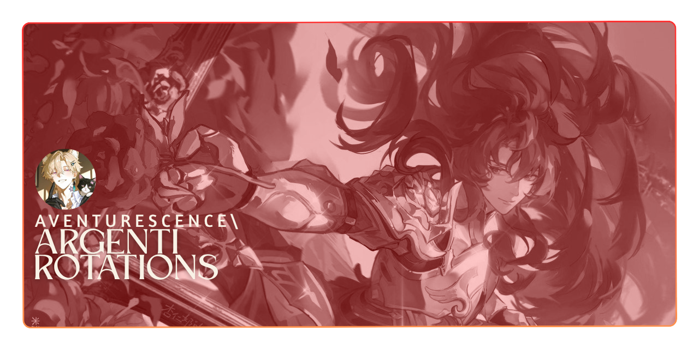

<p align="center">
  
  
</p>>

## Supported Rotations

### ChurinDNC

<p align="center">
  
  
  
</p>

#### Features:
* Technical Step: Uses Technical Step on cooldown and holds the GCD appropriately.
* Standard Step: Uses Standard Step when appropriate, ensuring it does not interfere with Technical Step.
* Enhanced Proc Management: Will try to go into burst windows without carrying over procs and ensuring that they don't fall off.
* Potion Presets: Uses potions at the configured times. Presets can be found in the config section of RSR and custom timings are available.

### ChurinBRD

<p align="center">

  

</p>

#### Features:
* Rotation Presets: Uses songs and transitions at the configured times appropriate to the selected preset.
* List of Presets:
   * Standard
   * Adjusted Standard
   * 3-6-9
   * Custom
* Potion Presets: Uses potions at the configured times. Presets can be found in the config section of RSR and custom timings are available.
## Installation:

To Install, paste this url into the Rotations Section of RSR.
```
https://github.com/aventurescence/ArgentiRotations/releases/latest/download/ArgentiRotations.dll
```

## To Do:
1. [ ] **_ChurinMCH_**
2. [ ] **_ChurinSCH_**